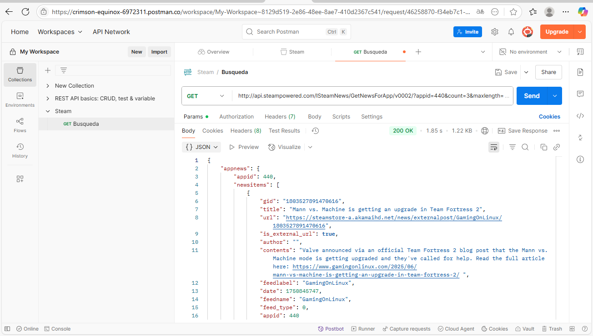
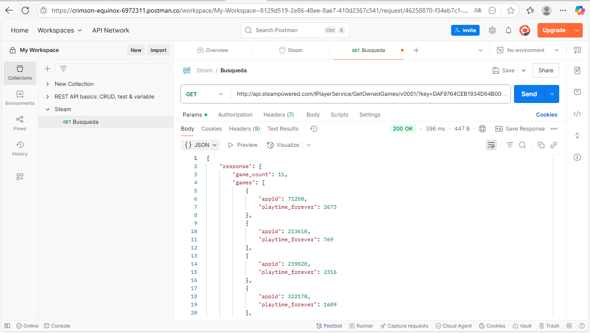
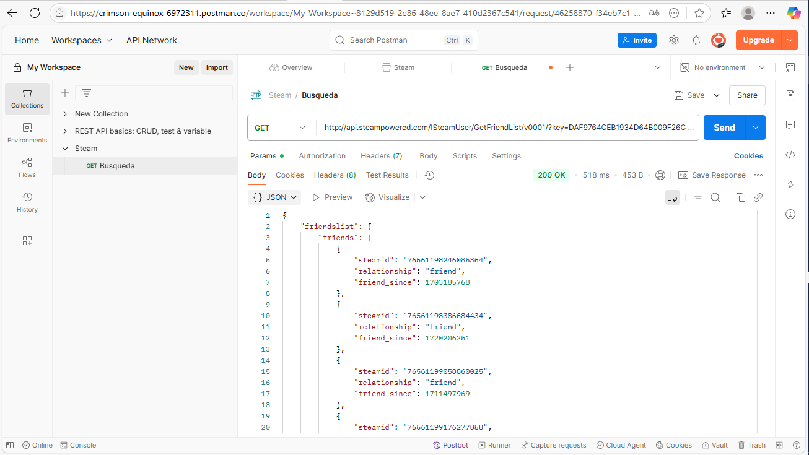

# My Steam News 

**My Steam News** Te permite encontrar las ultimas noticias de los juegos disponibles en la tienda de Steam. Conectate a tu perfil y recibe las noticias de los juegos de tu biblioteca directamente al entrar a la aplicación. Explora los perfiles de tus amigos e enviales las noticas más interesantes y curiosas de sus juegos favoritos!!
---

## 🚀 Características principales

- Busca cualquier elemento de la tienda de Steam para descubrir sus ultimas N noticias.
- Vincula tu perfil a la aplicación y ve las noticias de los juegos de tu biblioteca o lista de deseados directamente en la pantalla Home o en su propia pantalla.
- Ajusta tus preferencias para adaptar tu busqueda de noticias a tu comodidad.
  - Usa modo claro o oscuro.
  - Elige cuantas noticias recibir tanto al buscar manualmente como en tu pantalla home.
  - Selecciona y guarda tus noticias favoritas para verlas en cualquier momento. 
  - Añade juegos de los que te gustaría recibir noticias que no esten en tu perfil de Steam.
- Comparte las noticias que te encuentres directamente desde la APP.
- Busca los perfiles de tus amigos y descubre las noticas de sus juegos también.
- 
---

## 🛠️ API utilizadas

My Steam News trabaja directamente con las API´s oficiales de Steam.

- ISteamNews : Para obtener las ultimas N noticas de un Item de la tienda de Steam (entiendase juegos/DLC/Banda sonora, etc).
- IPlayerService : Para obterner los juegos de la biblioteca de algún usuario en particular.
- ISteamUser : Para obterner datos directamente de los perfiles de algún usuario.

Para más información dirijase a la documentación oficial de las API´s de Steam disponibles en: https://steamcommunity.com/dev o directamente en: https://developer.valvesoftware.com/wiki/Steam_Web_API

---

## 🖼️ Evidencia de pruebas de la API

Usando la API ISteamNews para mostrar las ultimas 3 noticas del juego Team Fortress 2 (ID 440)

Usando la API IPlayerService para ver la biblioteca de juegos del usuario con ID 76561199137893115 (Rodrigo Díaz, vease: https://steamcommunity.com/id/ItzInkGuy)

Usando la API ISteamUser para ver la lista de amigos del usuario con ID 76561199137893115 (Rodrigo Díaz, vease: https://steamcommunity.com/id/ItzInkGuy)
Sirve para obtener las ID´s de los amigos del usuario sin tener que ir a buscar sus ID´s manualmente.

---

## 📦 Instalación del APK

El APK se encuentra disponible en el respositorio dentro de la carpeta apk. Asegurate de habilitar los origenes desconocidos en tu dispositivo Android para 
poder instalarla sin problemas.

---

## 📄 Licencia

Este proyecto fue desarrollado como parte del curso *Programación Para Dispositivos Móviles* de la carrera Ingenieria en Desarrollo de Videojuegos y Realidad Virtual
que a su vez es impartida por la Universidad De Talca, en Talca, Maule, Chile. Visite http://videojuegos.utalca.cl/ para más información.

---

## ✨ Desarrollado por

**Rodrigo Díaz (ALIAS: IncGuy)**
IG: @ItzIncGuy
**Ignacio Alfaro**
Fono: +56 9 4545 4918
---
